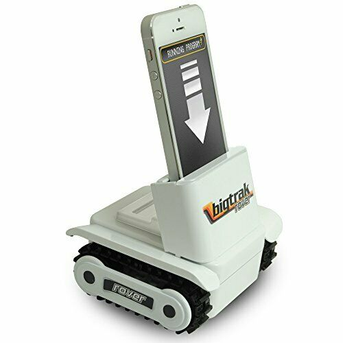
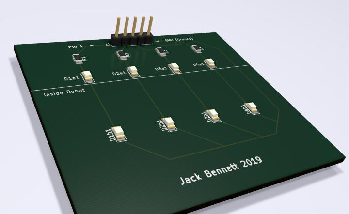

# BigTrak Rover Jr.

Make your own brains the to BigTrak Rover with a simple LED array and microcontroller. This replaces using a phone in the clamp.

## Parts

- Controller (Arduino in this case)
- x4 LEDs
- x4 matching resistors (560ohm)
- Some wires and connectors or soldering supplies. (Or included PCB)
- Something to insulate the wires from each other. Tape or surplus over sized wire you can strip. (Old electrical cable in this case)

## How

The BigTrak Rover is controlled by 4 light-sensitive diodes in a row. Exposing these to light in a specific order controls which motors are powered and the direction. Duration is controlled by the time the diode is lit.

The app works by holding a phone in a specific place that lights the screen in a specific order for the diodes.

This project will replace the phone.

We need something to hold 4 LEDs in place in front of the diodes and **also to press down on the power switch at the base of the phone clamp**.

## Control

Now we know how the rover works we need to create our prototype to prove the idea. So we need 4 LEDs wired up to you controller now, perfect time to get the breadboard out.

The logic we need do make the LEDs display is as [seen from the working out](logic_chart.jpg) photo.

Cleaned up looks like;

|   1   |   2   |   3   |   4   |               |
| :---: | :---: | :---: | :---: | ------------- |
|       |   x   |   x   |       | **forward**   |
|       |       |   x   |   x   | **left**      |
|   x   |   x   |       |       | **right**     |
|   x   |       |       |   x   | **reverse**\* |

\* The Big Trak app they give you for your phone doesn't actually have reverse. We found this by experimenting.

## Programming
Once you've made a sequence of lights to move the robot, Try making a sequence that can repeat the robots motion so it finishes where it started and loops forever. You'll run into some interesting control problems to thing about

further areas to program might be if you can blink the lights very quickly as a form of speed control.

### Fancy Terms
This first programming you want to do is abstract setting pin number values in sequence making an interface you can read/call easily.
Next you're going to explore are problems using an algorithm with an open control loop system.

## Measurements

There is an SLT and the source SketchUp template for a mounting plate included.
Below lists the measurements used to create those.
The template cuts the control board from the waste in the middle of the mounting board.
Use the small excess rectangles that are cut out to pad the control boards width for the clamp.

### Control Board
Corrugated card the thicker the better to clamp down. 65mm width by 40mm* height.
Place the tip of the LEDs 20mm up from the bottom of the card relative to the clamp.
Space the LED tips 12.5mm apart starting 15mm from one edge of the board.

| Desc. | width | height | offset from bottom |
| ----- | ----- | ------ | ------------------ |
| Size  | 65mm  | 40mm\* |                    |
| LED 1 |       |        | 20mm               |
| LED 2 |       |        | 20mm               |
| LED 3 |       |        | 20mm               |
| LED 4 |       |        | 20mm               |

\* This is a minimum height for the top of the clamp to reach the bottom power switches.

We should end up with something that looks a bit like; 

I hope yours turns out neater. The LED legs were insulated after taking this picture. Make sure yours can't short out when moved around.

### Control Board PCB (Printed Circuit Board)

In the PCB folder is a KiCad project which makes a suitable PCB of the above measurements with SMD (Surface Mount Device, as opposed the through hole like above) components.

This can be made to order reasonably cheaply but it's fiddly if you place components yourself and 3mm x 2mm squares may not be appropriate for children in a club. If you do please consider making a pull request adding to [the real world log](PCB/Manufacture.log)

### Mounting Board (optional)

Mounting board is a rectangle to hold the Arduino and servo to the robot. It's not required to get started. There is a SketchUp mount.skp included which has the all the dimensions useful, we ran ours off on with a laser cutter and 3mm ply wood.
Place all the cut-outs centrally but relative to the front of the mounting board.

| Desc.                  | width | height | offset from front |
| ---------------------- | ----- | ------ | ----------------- |
| Size                   | 100mm | 155mm  | n/a               |
| Central Cutout         | 75mm  | 32mm   | 38mm              |
| Clamp access           | 20mm  | 40mm   | 80mm              |
| Servo Cutout           | 19mm  | 25mm   | 6mm               |
| Arduino mounting holes |       |        |                   |
