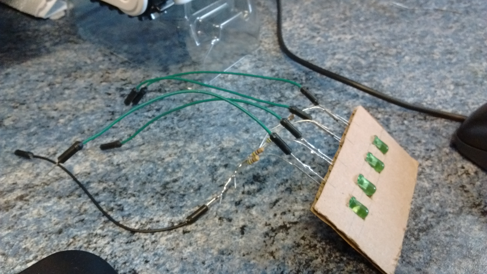

# BigTrak Rover Jr.

Make your own brains the to BigTrak Rover with a simple LED array and microcontroller.

## Parts

- Controller (arduino in this case)
- x4 LEDs
- x4 matching resistors (560ohm)
- Some wires and connectors or soldering supplies.
- Something to insulate the wires from each other. Tape or surplus over sized wire you can strip. (Old electrical cable in this case)

## How

The BigTrak Rover is controlled by 4 light-sensitive diodes in a row. Exposing these to light in a specific order controls which motors are powered and the direction. Duration is controlled by the time the diode is lit.

The app works by holding a phone in a specific place that lights the screen in a specific order for the diodes.

This project will replace the phone.

We need something to hold 4 LEDs in place in front of the diodes and also to press down on the power switch at the base of the phone clamp.

## Control

Now we know how the rover works we need to create our prototype to prove the idea. So we need 4 LEDs wired up to you controller now, perfect time to get the breadboard out.

The logic we need do make the LEDs display is as [seen from the working out](logic_chart.jpg) photo.

Cleaned up looks like;

|1|2|3|4||
|:---:|:---:|:---:|:---:|---|
||x|x||**forward**|
|||x|x|**left**|
|x|x|||**right**|
|x|||x|**reverse**\*|

\* The bigtrak app they give you for your phone doesn't actually have reverse. We found this by experimenting.

## Measurements

There is an SLT and the source sketchup template for a mounting plate included.
Below lists the measurements used to create those.
The template cuts the control board from the waste in the middle of the mounting board.
Use the small excess rectangles that are cut out to pad the control boards width for the clamp.

### Control Board
Corrugated card the thicker the better to clamp down. 65mm width by 40mm* hieght.
Place the tip of the LEDs 20mm up from the bottom of the card relative to the clamp.
Space the LED tips 12.5mm apart starting 15mm from one edge of the board.

|Desc. | width | height | offset from front|
|------|-------|--------|------------------|
|Size  | 65mm  | 40mm*  ||
|LED 1 |       |        | 20mm |
|LED 2 |       |        | 20mm |
|LED 3 |       |        | 20mm |
|LED 4 |       |        | 20mm |

\* This is a minimum height for the top of the clamp to reach the bottom power switches.

We should end up with something that looks a bit like; 

I hope yours tuns out neater. The LED legs were insulated after taking this picture. Make sure yours can't short out when moved around.

### Mounting Board

Mounting board is a rectangle to hold the arduino and servo to the robot.
Place all the cutouts centralls but relative to the front of the mounting board.

|Desc. | width | height | offset from front|
|------|-------|--------|------------------|
|Size  | 100mm | 155mm  | n/a |
|Central Cutout | 75mm | 32mm | 38mm |
|Clamp access  | 20mm | 40mm | 80mm |
|Servo Cutout | 19mm | 25mm | 6mm |
|Arduino mounting holes| | | |
